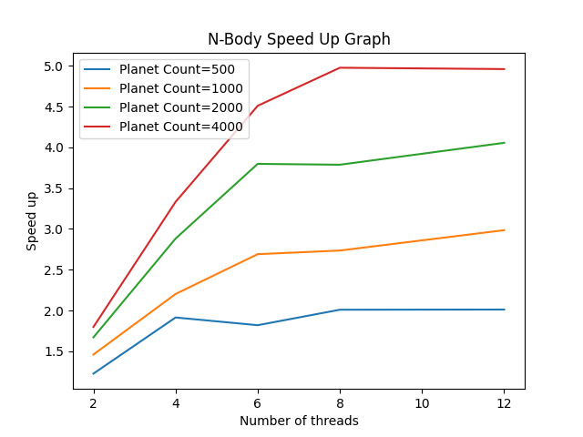

# MPCS 52060 Project 3

## Describe

- In this program, we can simulate particle interations with each other gravitationally. The program will take the input of an n-body system, and update the particle location step by step.

## How to run
```
go run proj3/main [thread count]
```
The program will load json of task until reaching EOF from standard in and output results line by line to standard out.

There is a program help us visulize the result in ``./proj3/samples/result_visulize.htm``

- Demo: 
    - Linux: ``./proj3/samples/genreateSampleResults.sh``
    - Windows: ``./proj3/samples/genreateSampleResults.bat``py

- Task Format:
    ```json
    {
        "step": 0.25,
        "g": 1,
        "iterations": 1000,
        "softning": 1e-8,
        "planets": [
            {
                "mass": 0.9,
                "location": {
                    "x": 2.0,
                    "y": 0.9873603193109426,
                    "z": -0.3737148768781189
                },
                "speed": {
                    "x": -0.22608750878620293,
                    "y": 0.5604692186013283,
                    "z": -1.3030889423475713
                }
            }
        ]
    }
    ```
    - The task can contains mutiple planets.

- Results Format:
    ```json
    {
        "timestamp": 0.25,
        "planets": [
            {
                "mass": 1.1046602879796197,
                "location": {
                    "x": -8.801579917561623,
                    "y": -2.3764712022411807,
                    "z": 0.7382015473001813
                },
                "speed": {
                    "x": -45.77853778332679,
                    "y": -13.455326086208494,
                    "z": 4.447665696713201
                }
            }
        ]
    }
    ```

# Files

- ``./proj3`` The golang modules folder, all code for n-body simulation will be inside of it.

    - ``./proj3/benchmark/`` benchmark codes

    - ``./proj3/data/`` All data structure we need to run simulation
        - ``./proj3/data/planet.go`` Data structure describing a single planet. Few supporting functions that updates it status are also inside of it.
        - ``./proj3/data/result.go`` Data structure describing an output result.
        - ``./proj3/data/task.go`` Data structure describing an input task.
        - ``./proj3/data/vector3.go`` Data structure describing an input task. The vector arithmetic functions are implemented in this file.

    - ``./proj3/main/`` Main function implementation and tests.
        - ``./proj3/main/nbody.go`` Holding the main function of the program, that will call sequence and bsp implementations in other files.
        - ``nbody_test.go`` It implements two tests: 
            - ``TestValidation`` validate results by comparing results in sequential version and parallel version.
            - ``TestBenchmark`` will benchmark program by genrate random input with size defined in environment varible.

    - ``./proj3/nbody/`` Functions holdings main n-body simulation logic.
        - ``./proj3/nbody/sequential.go`` sequencial version of n-body program.
            - ``RunSeqential()`` function will read tasks until EOF reached. After each task read, the program will simulate task in ``runTaskSeqential()``
            - ``runTaskSeqential()`` are holding most simulating code in it. It will calculate forces by interacting all planet each other, and update speed and location based on force.
        - ``./proj3/nbody/bsp.go`` BSP parallized version of n-body program
            - ``RunBSP()`` function will excute the ``executeBSP`` which is major function that holding the n-body logic.
            - ``bspBlocking()`` which blocks bsp using a conditional varible and shared counter. It will also take a aggrate function.
            - ``generateRange()`` will genrate range of planets each thread need to process.
            - ``initBSPContext()`` will init the shared context of BSP program.
            - ``updateContext()`` will output the current status of result and update the bspContext.
            - ``executeBSP()`` run the simulation of n-body. In each itereation, the program will do flowing steps:
                - Calculate the planets the thread should run.
                - Check if the program should be finished.
                - Run super step 1, that calculate forces for planets
                - Block program
                - Run super step 2, that updates the planets location
                - Block program and update shared context.

# How to test

- Using python 3 to run file ``./proj3/benchmark/run_benchmark.py``, the speedup graph will be genereated on ``./proj3/benchmark/slurm/out/speedup.png``

- On peanut cluster, we can dirctly type ``sbatch run_benchmark.py`` in ``./proj3/benchmark/`` folder.

# Test result



- Running Environment:
    - CPU: Intel i7-12700k
    - CPU spec: 
        - Cores: 8+4 core / 20 threads
        - Frequency: 4.90 GHz / 3.80 Ghz (Performance cores / Efficient Cores)
    - OS: Ubuntu 20.04 LTS on WSL2
    - Memory: 32GB DDR4 3000 Mhz


# Write up

- Describe in detailed of your system and the problem it is trying to solve.
    - See "Files" section.

- A description of how you implemented your parallel solution.
    - See "Files" section.

- Describe the challenges you faced while implementing the system. What aspects of the system might make it difficult to parallelize? In other words, what to you hope to learn by doing this assignment?
    - Since there are two complete diffrent steps we need iterate through all planets with diffrent logic. We need two different super-step implement in BSP.
    - In my program I used two diffrent counter in order to block two different super step.

- Specifications of the testing machine you ran your experiments on (i.e. Core Architecture (Intel/AMD), Number of cores, operating system, memory amount, etc.)
    - See "Test result" section.

- What are the hotspots and bottlenecks in your sequential program? Were you able to parallelize the hotspots and/or remove the bottlenecks in the parallel version?
    - There are two hotspots in n-body simulation. One is caclualting the forces, and one is updating the location. The bottle neck of program is the json encode part.
    - All hotspot has been parallized, but the bottleneck is still exist in parallelized implementations.

- What limited your speedup? Is it a lack of parallelism? (dependencies) Communication or synchronization overhead? As you try and answer these questions, we strongly prefer that you provide data and measurements to support your conclusions.
    - Communication overhead are the major limitation of speedup. I measured the total time take calling ``bspBlocking()`` for last blocked threads, and time calling codes. When the threads number incerase, the ``bspBlocking()`` took longer to run. For other part of program it shortened time linearly by thread number.
    - Blocking timing code can find in ``TimingMod.md``
    - We can see timing result below.
        ```
        user@ubuntu main % go run proj3/main 2 < ../samples/test3.json 1> /dev/null
        Blocking: 1.679419
        Non-Blocking: 31.302164
        user@ubuntu main % go run proj3/main 4 < ../samples/test3.json 1> /dev/null
        Blocking: 1.701379
        Non-Blocking: 17.439106
        user@ubuntu main % go run proj3/main 6 < ../samples/test3.json 1> /dev/null
        Blocking: 1.709008
        Non-Blocking: 11.791596
        user@ubuntu main % go run proj3/main 8 < ../samples/test3.json 1> /dev/null
        Blocking: 1.765167
        Non-Blocking: 9.223639
        ```

- Produce speedup graph(s) for those data sets.
    - See "Test result" section.

# Advance Feature

Parallel version of n-body simulator is implementated under ``BSP`` parallel model. The implemetation detail are explained in "File" section.

# Reference

Princeton University. (n.d.). N-body simulations. Princeton University. Retrieved December 1, 2021, from https://physics.princeton.edu/~fpretori/Nbody/intro.htm. 